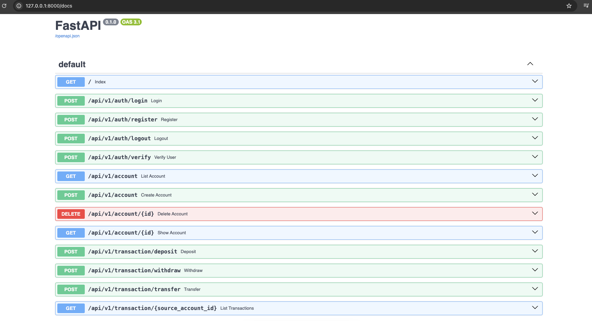

# e-money

### e-money is an example of a simple bank application.

Every user can create accounts and deposit money, withdraw money, check balance and deposit money to other accounts through these accounts. You can view transactions for your accounts.

> FastAPI(Python3.12), PostgreSQL(16), NextJS(14) and Chakra UI(2.8) are used in this application.

<h4>Run server on your localhost: </h4>

1. open your postgresql database on local machine
2. pip install -r requirements.txt
3. check your database credentials
4. cd server && uvicorn app.main:app --reload

<h4>Run client on ypur localhost: </h4>

1. cd client
2. npm install
3. npm run dev

